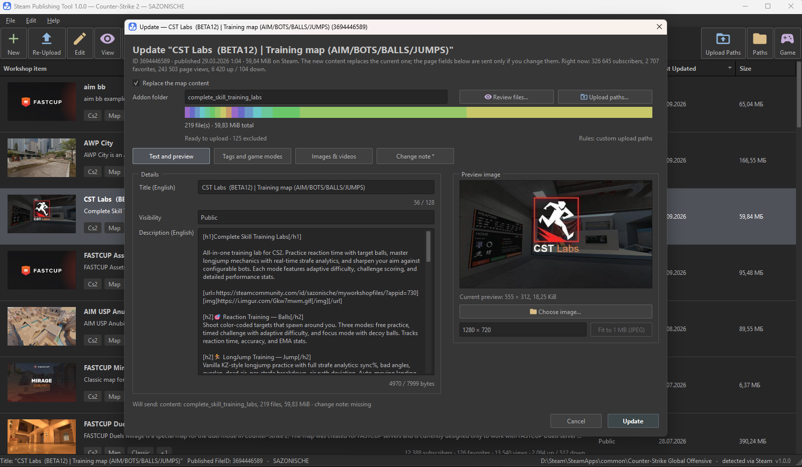

# Steam Publishing Tool

Publish and manage your **Counter-Strike 2** and **Portal 2** Workshop maps from one window. The tool does what Valve's workshop manager does — packs your compiled addon and uploads it — and adds what it lacks: animated GIF previews, any tags you like, Unlisted visibility, extra screenshots and YouTube videos, and live subscriber numbers.

## What you need

- Windows 10 or 11, 64-bit.
- Steam running and logged in with the account that owns the maps.
- The game installed, if you want to publish or update maps. Just looking at your items and editing their pages works without it.

Nothing else. The tool is a single `SteamPublishingTool.exe`, no installation, no extra libraries.

## Getting started

1. Download the exe from [Releases](../../releases) and run it. Windows may warn that the file is unsigned; that is expected.
2. Pick the game. Steam and game folders are found automatically; if not, *Paths…* lets you point to them.
3. You see every map you have published: preview, description, tags, visibility, size, subscribers, favorites, views and votes.

## Publishing a new map

1. Compile your map in the Workshop Tools as usual, so the addon folder in `game\csgo_addons\<your addon>` contains it.
2. Press **New**, pick the addon folder. The tool shows how many files will be packed and lets you review them.
3. Write the title and description, choose a preview image (JPG, PNG or an animated GIF under 1 MB — *Fit to 1 MB* shrinks it for you), tick the game modes, add your own tags.
4. Press **Publish**. Try **Private** visibility first, check the map in the game, then switch it to Public in *Edit*.

The VPK is built exactly like Valve's manager builds it, so the game accepts the map. If the upload fails, the half-created item is removed again.

## Updating a map

Double-click the map, or select it and press **Re-Upload**. The addon folder is preselected; write a change note (it is required for updates) and press **Update**. You can change the description, tags or preview in the same window; only what you changed is sent.

## Editing the Workshop page

Select the map and press **Edit** (or Ctrl+E). Title, description, visibility, tags, preview, extra images and videos — change what you need and press **Submit**. Nothing is sent if you changed nothing.

Texts are read and written in **English** by default. Steam keeps a separate text per language, so change the language under *File → Workshop Language* if you maintain another one.

## Good to know

- **Required tags.** CS2 needs the `CS2` and `Map` tags to show a map in the in-game browser. They are pre-checked; a map missing them is flagged in the list.
- **Upload paths.** Which folders of the addon go into the VPK is read from the game itself. If you keep extra folders in your addon (custom player models, panorama icons), add them in *Paths… → Upload paths*; the list is yours and survives game updates.
- **Size limit.** Maps over 2 GB are refused before packing, same as in Valve's manager.
- **Delete** asks for an explicit confirmation. It cannot be undone.
- **Portal 2** works the same way with a compiled `.bsp`: the map is read, its tags are pre-checked, and it goes to the Workshop the way Valve's uploader does.
- Settings live in `%USERPROFILE%\.steam-publishing-tool\`. Only one copy of the tool runs at a time; starting it again brings the open window to the front.

## License

See [LICENSE](LICENSE). Steamworks SDK files are © Valve Corporation.
